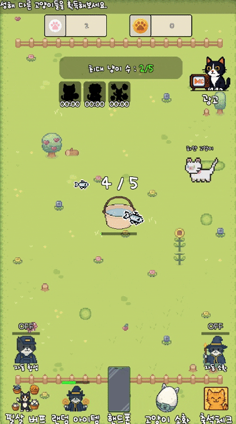
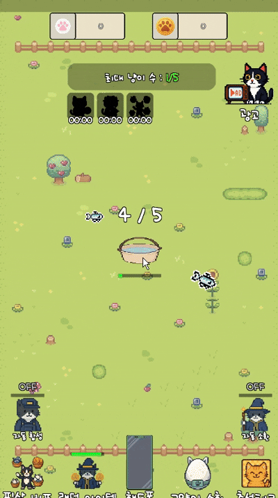
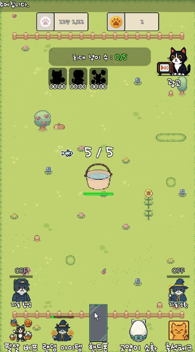
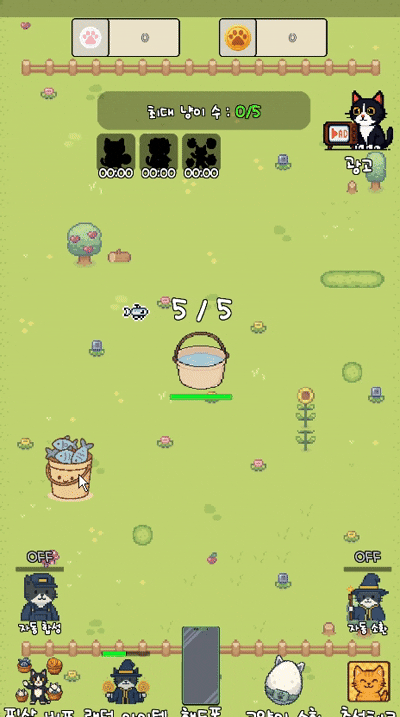
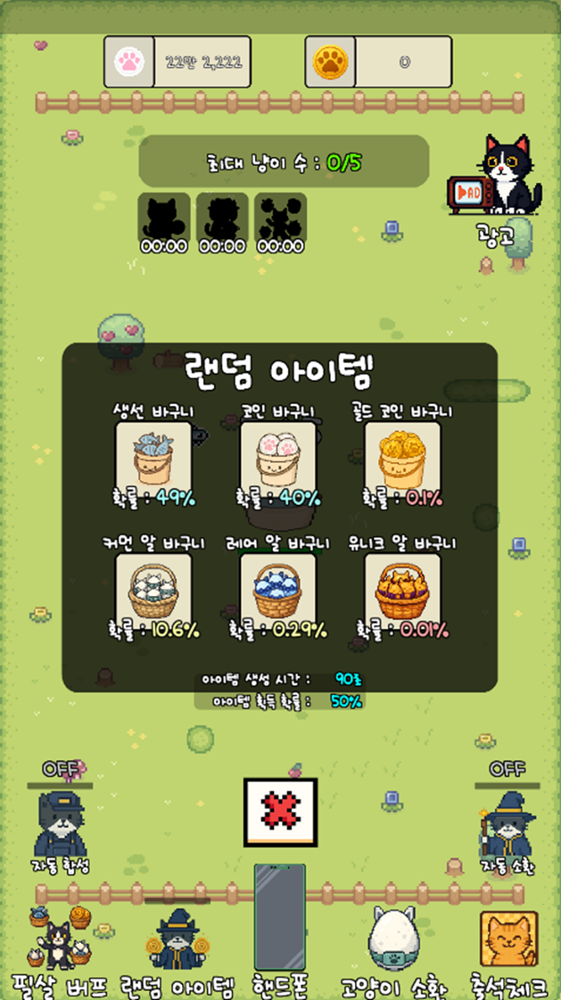
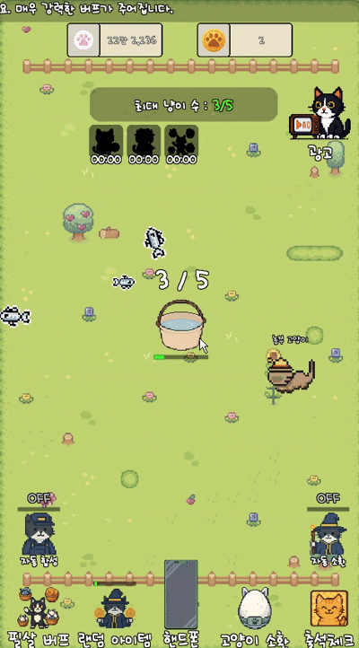
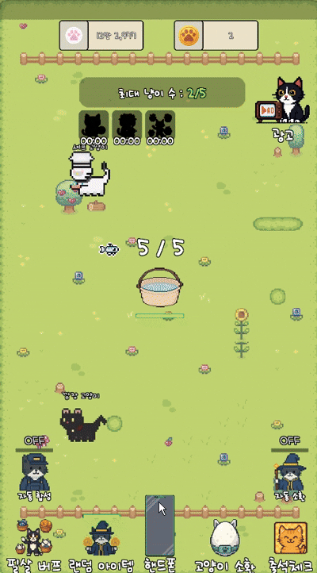
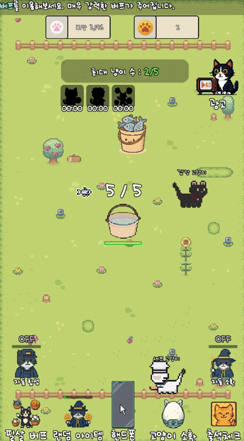

# [Unity 2D] 고양이 키우기
> Mobile Platform

 

# 📘 소개
<table align="center">
  <tr>
    <td align="center">
      
    </td>
    <td align="center">
      
    </td>
    <td align="center">
      
    </td>
    <td align="center">
      
    </td>
    <td align="center">
      
    </td>
  </tr>
  <tr>
    <td align="center">고양이 소환</td>
    <td align="center">고양이 합성</td>
    <td align="center">고양이 헬스장</td>
    <td align="center">고양이 자동 소환/합성</td>
    <td align="center">고양이 유물 강화</td>
  </tr>
</table>

+ 본 게임은 방치형 RPG 장르의 고양이 합성 게임입니다.
+ 같은 레벨의 고양이 두 마리를 합성하면 다음 레벨의 고양이가 등장하는 간단하고 직관적인 합성 구조를 기반으로 합니다.
+ 귀여운 고양이를 메인 콘셉트로 설정했으며, 플레이어는 다양한 고양이를 수집하고 합성하며 성장시켜 
+ 최종 목표인 30레벨 고양이를 획득하는 것을 목표로 게임을 즐기게 됩니다.

 

# 🛠️ 개발 환경

| 구성 요소 | 내용 |
|:---|:---|
| **엔진** | Unity 2021.3.21f1 (LTS) |
| **언어** | C# |
| **플랫폼** | Android (모바일 빌드 대상) |
| **버전 관리**| GitHub |

   

# 🧪 사용 기술
| 기술 항목 | 설명 |
|:---|:---|
| **디자인 패턴** | 싱글톤(Singleton) + Static 구조를 결합하여 게임 매니저 클래스들을 효율적으로 관리 |
| **저장 방식** | 게임 데이터를 JSON 형태로 저장 및 불러오며, Dictionary 구조도 포함 |
| **프리팹 활용** | 자주 사용되지 않는 객체는 필요할 때마다 Prefab으로 동적 생성하여 메모리 효율 최적화 |

 

# 🚀 게임 주요 시스템 및 설계 포인트

## 고양이 소환 시스템
- 고양이 소환은 물고기 통을 클릭해 물고기를 소환하는 방식으로 진행됩니다. 
- 소환된 물고기는 일정 시간이 지나면 자동으로 고양이로 변환되며, 이를 통해 고양이를 획득할 수 있습니다.
- 고양이 헬스장을 통한 물고기 업그레이드가 진행될수록,
- 고양이 소환 시 상위 등급 고양이가 등장할 확률이 증가하도록 설계했습니다.

<table align="center">
  <tr>
    <td>
      
    </td>
    <td>
      
    </td>
  </tr>
  <tr>
    <td align="center">고양이 소환</td>
    <td align="center">고양이 업그레이드 소환</td>
  </tr>
</table>

---

## 필드 아이템 시스템
- 필드 아이템은 90초마다 1개씩 생성됩니다.
- 필드에는 최대 5개까지 아이템을 보유할 수 있으며, 최대치를 초과할 경우 추가로 생성된 아이템은 보관되지 않습니다.
- 아이템 생성 자체는 100% 확정으로 이루어지지만, 생성되는 아이템의 종류는 확률에 따라 결정됩니다.
- 또한 필드에 생성된 아이템은 60% 확률로 획득 가능합니다.
- 아이템 획득 확률에 부담을 느끼는 유저는 유틸성 업그레이드에 더 투자하게 되고,  확률 요소를 선호하지 않는 유저는 코인 또는 고양이 강화를 통해 성장을 선택하게 됩니다.

<table align="center">
  <tr>
    <td>
      
    </td>
    <td>
      
    </td>
  </tr>
  <tr>
    <td align="center">고양이 아이템 소환</td>
    <td align="center">고양이 아이템 종류</td>
  </tr>
</table>

---

## 고양이 합성 시스템
- 합성 방식은 두 가지로 구성되어 있습니다.
- 일반 합성: 합성 시 결과 고양이의 레벨이 +1 상승
- 대박 합성: 일정 확률로 발동되며, 고양이의 레벨이 +1 ~ +3까지 상승
- 이 구조를 통해 성장이 눈에 보이게 설계하였으며, 대박 합성 발생 시의 기대감과 재미 요소를 동시에 제공하도록 설계했습니다.

<table align="center">
  <tr>
    <td>
      
    </td>
    <td>
      
    </td>
  </tr>
  <tr>
    <td align="center">고양이 일반 합성</td>
    <td align="center">고양이 대박 합성</td>
  </tr>
</table>

---

## 고양이 자동 소환/합성
- 고양이 자동 소환 및 합성은 기본적으로 60초마다 진행됩니다.
- 광고를 통해 제공되는 자동 소환 및 합성 기능은 기본 기능과 성능 차이는 없지만, 유틸성 측면에서 차이를 내게 했습니다.
- 유틸성 업그레이드를 **최대 레벨(Max)**까지 강화할 경우, 고양이 자동 소환 및 합성 주기는 60초에서 20초로 단축 됩니다.
- 또한 광고는 시청할 때마다 자동 소환 및 합성의 지속 시간이 누적 증가하는 구조로 설계하여, 유저가 필요에 따라 능동적으로 광고를 선택하도록 유도했습니다. 이를 통해 강제성이 아닌 선택 기반의 광고 소비 경험을 제공하고자 했습니다.

<table align="center">
  <tr>
    <td>
      
    </td>
  </tr>
  <tr>
    <td align="center">고양이 자동 소환/합성</td>
  </tr>
</table>

---

## 고양이 헬스장
- 게임의 귀여운 컨셉에 맞춰 업그레이드 시스템 명칭을 “고양이 헬스장”으로 설정하였습니다.

- 고양이 헬스장에서는 재화 및 고양이 마리수를 증가시킬 수 있는 물품들을 판매합니다. 반면 수상한 상점에서는 유틸성 업그레이드만 할 수 있는 물품으로 구성하여 기능적으로 구분해 제작하였습니다.

- 각 업그레이드는 최대 레벨이 명확히 표시되며, 최대 레벨을 달성할 경우 “Lv.Max”로 표기되어 직관성을 높혔습니다.
 
- 재화 사용 역시 구분하였습니다.
- 고양이 헬스장 	: 일반 코인으로만 업그레이드 가능
- 수상한 상점	: 골드 코인으로만 업그레이드 가능

<table align="center">
  <tr>
    <td>
      
    </td>
  </tr>
  <tr>
    <td align="center">고양이 헬스장</td>
  </tr>
</table>
    
 

---

## 필살 버프
- 필살 버프는 하루에 한 번, 20분 동안 매우 강력한 능력을 부여하는 핵심 시스템입니다.

- 일일 퀘스트처럼 ‘하루에 한 번 꼭 접속해서 사용해야 할 요소’를 제공함으로써, 유저가  게임에 접속하는 진입 장벽을 낮춰주었습니다.

- 20분의 버프 시간이 종료되면 게임 효율이나 유틸성에서 체감되는 차이를 두어, 이 구간에서 광고 시청 또는 과금 아이템을 유도 할 수 있도록 설계했습니다.

- 이를 통해 플레이 흐름을 해치지 않으면서도 자연스러운 수익 구조를 유도합니다.

<table align="center">
  <tr>
    <td>
      
    </td>
  </tr>
  <tr>
    <td align="center">고양이 필살 버프</td>
  </tr>
</table>
    
 

---

## 고양이 유물 강화
- 고양이 유물 강화는 고양이 “대박 합성“ 확률과 고양이 소환권 획득 확률을 상승시키는 성장 시스템입니다.

- 게임이 후반으로 진행될수록 대박 합성과 소환권의 중요도가 점차 커지도록 설계했기 때문에, 유물 강화는 초반에는 필수 요소가 아니지만 중·후반 구간을 넘어가기 위한 성장 사다리 역할을 합니다.

- 유물은 최대 27단계까지 강화 가능하며, 강화 실패 시 단계가 하락하지는 않지만 유물이 파괴될 경우 1단계로 초기화됩니다.

- 또한 파괴 방지 기능이 존재하며, 파괴 방지를 활성화할 경우 필요 재화가 3배로 증가하도록 설정하였습니다.

<table align="center">
  <tr>
    <td>
      
    </td>
  </tr>
  <tr>
    <td align="center">고양이 유물 강화</td>
  </tr>
</table>
    
 

---

## 고양이 상점(BM)
- 고양이 상점은 현금을 사용해 업그레이드하는 과금 전용 상점입니다.
- 과금 요소는 모두 게임의 편의성을 높여주는 상품으로만 구성했습니다.

- 고양이 상점에서 제공되는 주요 상품은 다음과 같습니다.
- 코인 2~5배 획득 효과가 100% 확정으로 적용되는 상품
- 강화 가능한 유틸성 상품을 최대 레벨까지 즉시 강화할 수 있는 상품
- 고양이 유물 강화 시 파괴 방지 효과를 상시 적용하고,
- 파괴 방지 적용 시 추가로 요구되는 코인 비용을 제거하는 상품

- 이를 통해 확률형 과금이나 재화 판매 중심의 구조를 지양하고,
- 유저가 체감 가능한 편의성·안정성 중심의 과금 선택지를 제공하도록 설계했습니다.

<table align="center">
  <tr>
    <td>
      
    </td>
  </tr>
  <tr>
    <td align="center">고양이 상점</td>
  </tr>
</table>
    
 

---

## 고양이 바구니
- 고양이 바구니는 고양이 알에서 획득한 고양이들이 보관되는 공간입니다. 
- 획득한 고양이들은 언제든 소환 가능하며, 미 발견 고양이도 획득 시 소환 가능합니다.

- 기존 SetActive 방식에서 발생하던 부하를 줄이기 위해, 오브젝트의 활성·비활성 전환 대신 Alpha 값을 조정하는 방식으로 렌더링을 제어했습니다.
- 이때 Alpha 조정 대상은 화면에 실제로 보이는 Content 개수 +2까지만 유지하도록 제한하여, 스크롤 시 불필요한 UI 연산을 최소화 하였습니다.

<table align="center">
  <tr>
    <td>
      
    </td>
  </tr>
  <tr>
    <td align="center">고양이 바구니</td>
  </tr>
</table>
    
 

---

## 고양이 도감 및 마켓
- 고양이 도감은 획득한 고양이를 확인할 수 있는 기록 공간입니다.
- 도감에서는 어떤 고양이가 존재하는지 사전에 확인할 수 없으며,
- 미획득 고양이는 실루엣과 표시되도록 설계했습니다.
- 이를 통해 수집의 완성도와 함께, 다음 고양이에 대한 기대감을 유도합니다.

- 고양이 마켓은 고양이 물품을 구매할 수 있는 공간입니다.
- 고양이 마켓에서 제공되는 아이템은 코인 획득량 증가 효과를 가지며, 해당 능력치는 고양이 마켓에서만 업그레이드가 가능하도록 제한했습니다.

<table align="center">
  <tr>
    <td>
      
    </td>
    <td>
      
    </td>
  </tr>
  <tr>
    <td align="center">고양이 도감</td>
    <td align="center">고양이 마켓</td>
  </tr>
</table>
    
 

# 📄 기술 문서

 

# ▶️ 소개 영상
+ [소개 영상](https://www.youtube.com/shorts/5yGMWK8CYLM)

